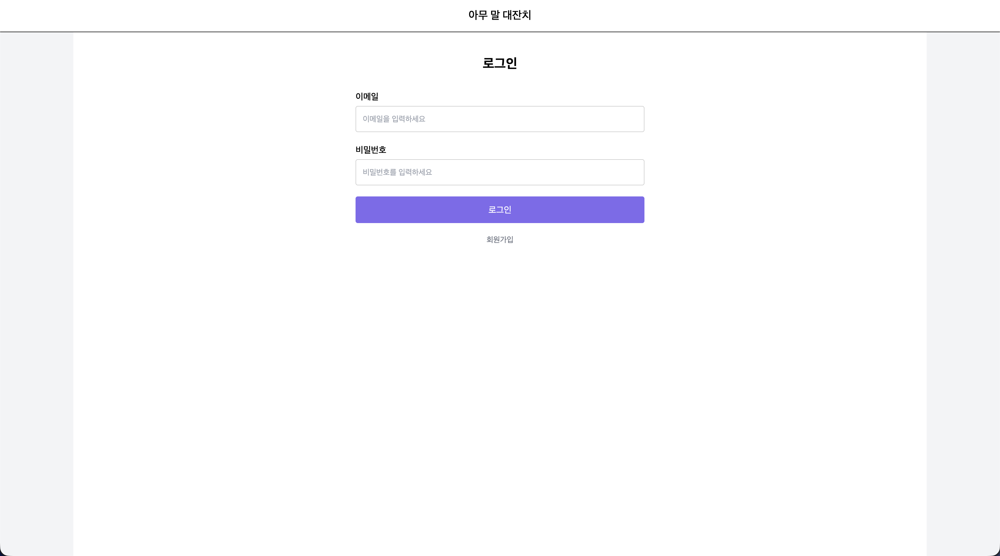
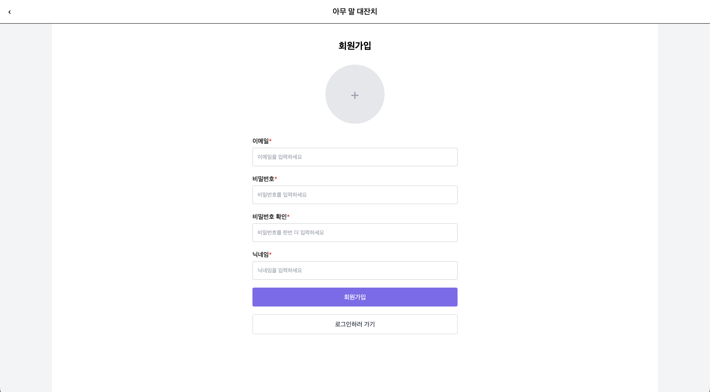
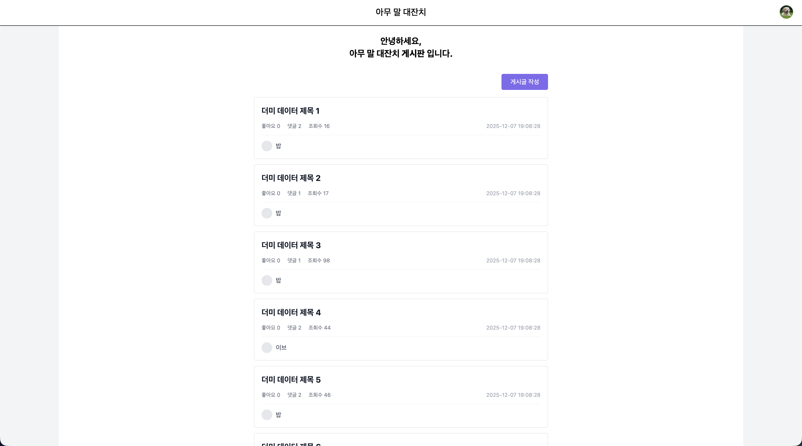
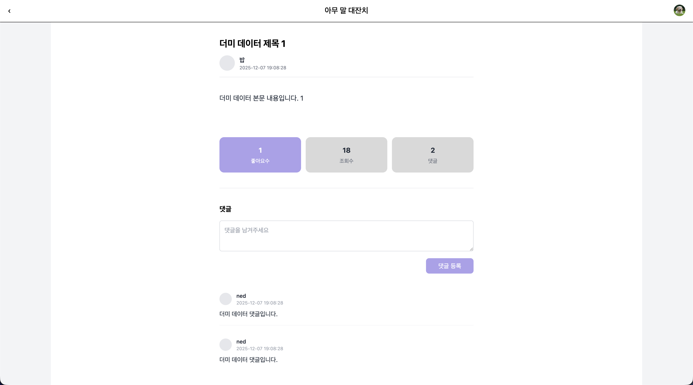
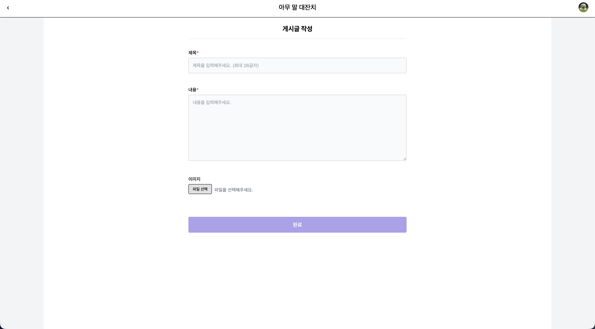
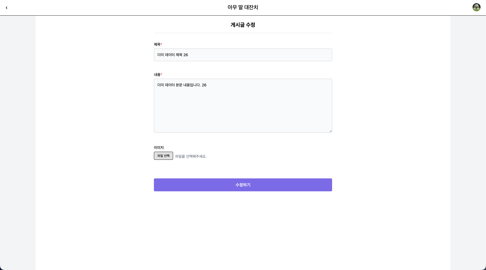
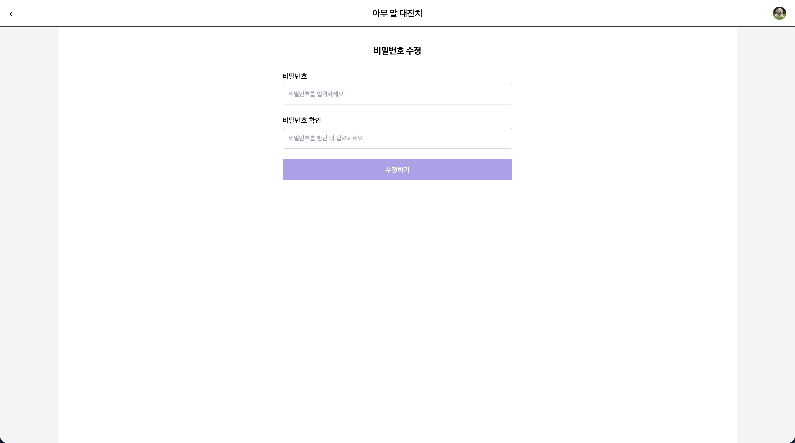

# 아무 말 대잔치 - Frontend

FastAPI + Tailwind CSS를 사용한 커뮤니티 플랫폼 프론트엔드

## Technology Stack

## Pages

### 1. 로그인 페이지
**경로:** `/login`

**주요 기능:**
- OAuth2 표준 폼 방식 로그인
- 실시간 유효성 검사 (이메일, 비밀번호)
- 로그인 실패 시 에러 메시지 표시

---

### 2. 회원가입 페이지
**경로:** `/signup`

**주요 기능:**
- 이메일, 닉네임, 비밀번호 입력
- 프로필 이미지 업로드 (선택)
- 비밀번호 확인 검증
- 실시간 유효성 검사
  - 이메일: 형식 검증
  - 닉네임: 1~10자, 공백 불가
  - 비밀번호: 8~20자, 대문자/소문자/숫자/특수문자 각 1개 이상
- 모든 조건 만족 시 버튼 활성화
- 회원가입 완료 토스트 메시지 표시

---

### 3. 게시글 목록 페이지
**경로:** `/posts`

**주요 기능:**
- 게시글 목록 표시 (최신순 정렬)
- 각 게시글 정보: 제목, 작성자, 작성일, 좋아요수, 조회수, 댓글수
- 게시글 작성 버튼 (인증 필요)
- 프로필 아이콘 클릭 → 드롭다운 메뉴

---

### 4. 게시글 상세 페이지
**경로:** `/posts/{id}`

**주요 기능:**
- 게시글 내용 전체 표시
- 좋아요/조회수/댓글수 표시
- 좋아요 버튼 (클릭 시 색상 변경)
- 댓글 작성/수정/삭제 (작성자만 가능)
- 게시글 수정/삭제 버튼 (작성자만 표시)
- 조회수 자동 증가

---

### 5. 게시글 작성 페이지
**경로:** `/posts/new`

**주요 기능:**
- 제목, 내용 입력
- 이미지 업로드 (선택)
- 실시간 버튼 활성화 (제목+내용 입력 시)
- 이미지 미리보기

---

### 6. 게시글 수정 페이지
**경로:** `/posts/{id}/edit`

**주요 기능:**
- 기존 데이터 자동 로드
- 제목, 내용 수정
- 기존 이미지 표시
- 이미지 삭제 버튼
- 새 이미지 업로드

---

### 7. 회원정보 수정 페이지
**경로:** `/profile/edit`

**주요 기능:**
- 프로필 이미지 변경
- 닉네임 수정 (1~10자, 공백 불가)
- 이메일 표시 (수정 불가)
- 회원 탈퇴 버튼 → 확인 모달

---

### 8. 비밀번호 수정 페이지
**경로:** `/password/edit`

**주요 기능:**
- 새 비밀번호 입력
- 비밀번호 확인 입력
- 실시간 유효성 검사
- 비밀번호 규칙: 8~20자, 대문자/소문자/숫자/특수문자 각 1개 이상
- 조건 만족 시 버튼 활성화

---

## UI/UX 디자인

### 색상 팔레트
| 색상 코드 | 용도 |
|----------|------|
| `#7F6AEE` | 활성화된 버튼, 주요 액션 |
| `#ACA0EB` | 비활성화된 버튼, 좋아요 활성 상태 |
| `#D9D9D9` | 중립 배경 (통계 박스) |
| `#E9E9E9` | 드롭다운 메뉴 호버 |

### 폼 검증 패턴
- 실시간 입력 검증
- 에러 메시지: 빨간색 헬퍼 텍스트
- 필수 항목 표시: 빨간색 asterisk(*)
- 버튼 상태 관리: 비활성(`#ACA0EB`) / 활성(`#7F6AEE`)

### UI 컴포넌트
- Toast 알림: 성공/에러 메시지
- 모달: 삭제 확인 (스크롤 방지)
- 드롭다운: 사용자 메뉴
